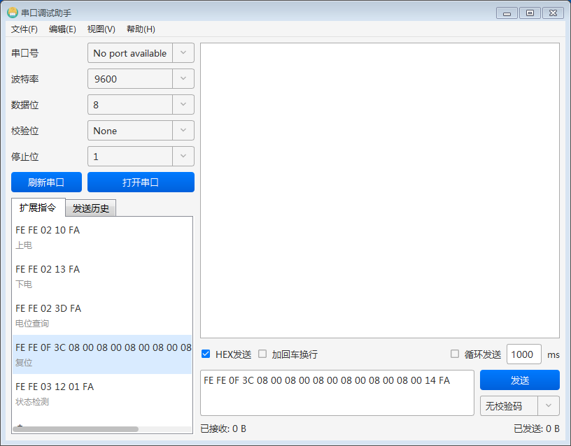
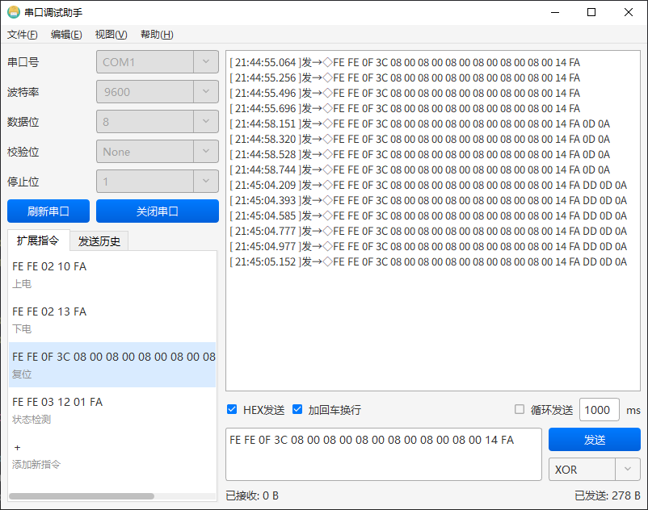
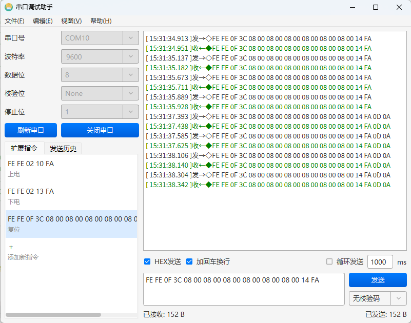
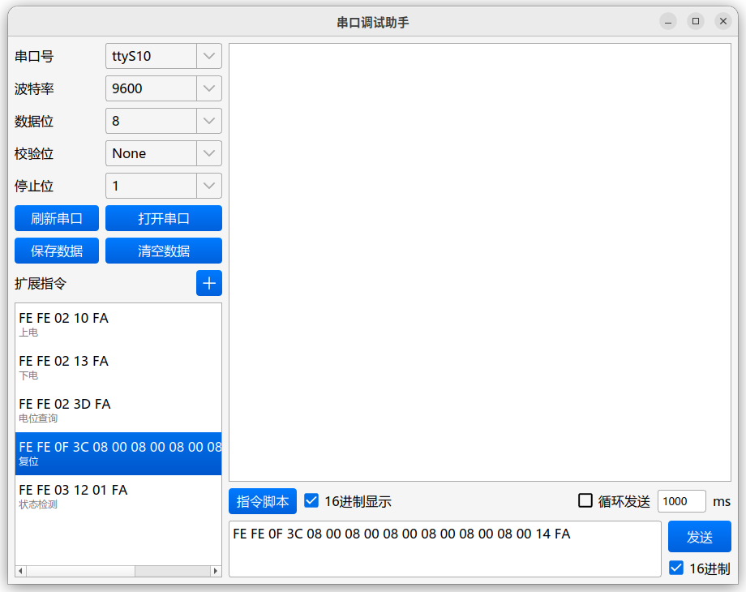

# SerialPortDebugger — 跨平台串口调试助手

## 概述

**SerialPortDebugger** 是一款基于 Qt 5 框架开发的**跨平台串口通信调试工具**，使用 C++ 编写，支持 Windows 和 Linux
双平台。软件提供了直观的图形界面，集成了串口参数配置、数据收发、指令管理、定时发送、脚本执行、日志保存等实用功能，适用于嵌入式开发、硬件调试、物联网设备测试等场景。

## 支持的平台

| 平台         | 架构      | 截图                                            |
|------------|---------|-----------------------------------------------|
| Windows 7  | 64位     |    |
| Windows 10 | 64位     |  |
| Windows 11 | 64位     |  |
| Linux      | AMD 64位 |    |
| Linux      | ARM 64位 |    |

## 功能特性

### 🔌 串口通信

- **自动检测**系统中所有可用串口，支持手动刷新
- 可配置的串口参数：
    - 波特率：`9600` / `14400` / `19200` / `38400` / `56000` / `57600` / `115200` / `128000` / `230400`
    - 数据位：`5` / `6` / `7` / `8`
    - 校验位：`None` / `Even` / `Odd` / `Mark` / `Space`
    - 停止位：`1` / `1.5` / `2`
- 串口开启后锁定参数，防止误操作

### 📨 数据收发

- 支持**文本模式**和 **HEX 十六进制模式**发送
- 发送区输入框与指令库联动，点击指令即可自动填入
- 接收数据支持**文本 / HEX 双模式**实时切换显示
- **颜色区分**：接收数据以绿色显示，发送数据以默认颜色显示
- 每条消息附带精确到毫秒的**时间戳**（格式：`时:分:秒.毫秒`）

### 📋 指令管理

- 基于 **SQLite 数据库**持久化存储常用指令
- 支持指令的**添加、编辑、删除、复制**操作
- 每条指令包含**指令值**和**备注**，方便识别
- **右键上下文菜单**快捷操作（发送 / 复制 / 编辑 / 删除）
- 指令去重检测，防止重复添加

### ⏱ 定时发送

- 支持按设定时间间隔**循环自动发送**当前指令
- 间隔时间以毫秒为单位，可灵活配置
- 一键启停，串口关闭时自动停止

### 📜 脚本执行

- 支持选择多条指令组成**执行脚本**
- 可独立设置每条指令之间的**发送间隔**
- 按顺序依次执行，执行完毕后弹窗提示
- 执行期间保护，防止重复启动

### 📝 日志保存

- 一键将通信历史记录**导出为 `.txt` 文件**
- 日志格式清晰：`[时间戳]【方向】数据内容`
- 支持清空显示区域，方便重新记录

## 技术架构

| 技术栈   | 说明                     |
|-------|------------------------|
| 开发语言  | C++11                  |
| UI 框架 | Qt 5（Widgets）          |
| 数据库   | SQLite（通过 Qt SQL 模块）   |
| 串口通信  | Qt SerialPort 模块       |
| 线程模型  | 串口 I/O 运行在独立线程，UI 线程安全 |

项目采用清晰的分层架构：

- **SerialPortManager**：串口管理器（单例模式，线程安全）
- **DatabaseWrapper**：数据库操作封装（单例模式）
- **TaskExecutor**：脚本任务执行器（基于 QTimer 的异步顺序执行）
- **CommandItemWidget**：自定义指令列表项组件
- **CommandScriptDialog**：脚本配置对话框
- **Utils**：工具类（HEX 转换、格式校验等）

## 构建说明

### 依赖

- Qt 5.x（需包含 `widgets`、`serialport`、`sql` 模块）
- 支持 C++11 的编译器

### 编译

```bash
qmake SerialPortDebugger.pro
make          # Linux
nmake         # Windows (MSVC)
mingw32-make  # Windows (MinGW)
```
